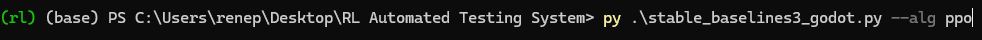
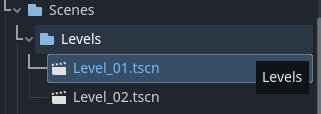
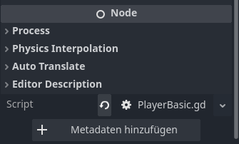
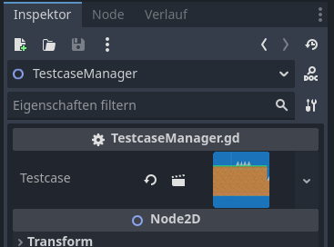

# 2D Platformer Starter Kit

A Godot-based 2D platformer kit that implements godot-rl-agents to setup a testing environment for simple levels with ppo / dqn

---

## Installation

1. **Clone the repository**
```bash
git clone https://github.com/yourusername/2d-platformer---starter-kit.git
```

2. **Open in Godot**V
- (Optional) If you don't have godot, please download a 4.x version
- Launch Godot Engine (version 4.x recommended)
- Open the cloned project folder

3. **Install Python dependencies**
```bash
pip install -r requirements.txt
```
- This will include `rl-godot-agents` and any other Python packages needed.

4. **Optional: Set up Git ignore**
- Make sure `.gitignore` is configured to ignore:
  - `logs/`
  - `*.tmp`
  - `.import/`

---

## Usage

- Open the `Scenes/Levels/Level_01.tscn` scene to start prototyping your first level.
- To add test cases or different player behaviors, see the `Testcases` folder and `TestcaseManager.gd`.
- Run the scene by pressing **F6** in Godot.

### AI Integration
- Ensure `rl_godot_agents` is installed via `requirements.txt`
- Use venc to switch into the virtual environment that is setup in the project
- You can run training scripts in Python that connect to the Godot project for reinforcement learning experiments.
  
- See the `ai` folder for example Python scripts using `rl_godot_agents`.


### Setting up a new level
- In order to test a new level copy the Level1.tscn located inside Scenes/Levels.

  
- Once the level is finished savVe it inside the folder
- Simply run the ai agent in python first and then start the level via **F6**

### Testing a different testcase
- Under testcases there is a basic tscn (Scene) which will be instantiated as default
- Duplicate the file and create a new copy of PlayerBasic.gd and rename it
- Add in the adjustments and after finalizing save it
- Add the new script here

  
- Open your level scene and click on the TestcaseManager node
- Add the new Player.tscn (however you named it) inside the inspector

  
- Run the python script and start the scene and it should work!

---

## Credits

- **Original Project:** [2D Platformer Starter Kit](https://github.com/AdilDevStuff/2D-Platformer-Starter-Kit)
- **Godot Engine:** [https://godotengine.org](https://godotengine.org)
- **RL Godot Agents:** [https://github.com/Calimucho/rl_godot_agents](https://github.com/Calimucho/rl_godot_agents)

